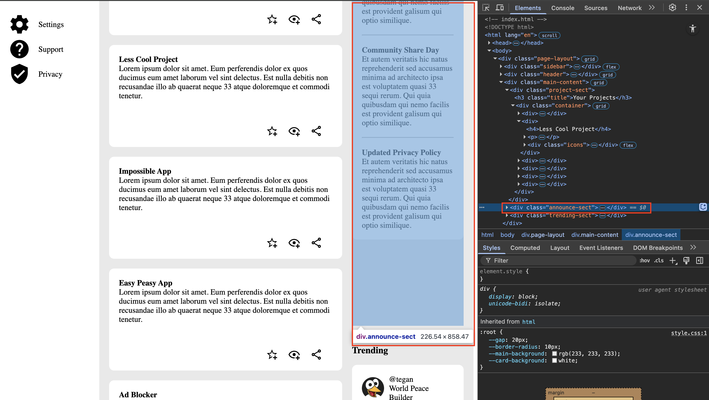

# The Odin Project: Admin Dashboard
This project is from [The Odin Project's Course](https://www.theodinproject.com/lessons/node-path-intermediate-html-and-css-admin-dashboard)

## Topics Covered
- Grid
    - Positioning Grid Elements
        - Describe the differences between tracks, lines, and cells.
        - Position items by defining their start and end lines.
        - Use shorthand notation.
    - Advanced Grid Properties
        - Create multiple grid tracks more easily using the `repeat()` function.
        - Create grid tracks using `fr` units instead of an explicit size.
        - Set minimum, maximum, and ideal track size boundaries.
        - Use auto-fit and auto-fill to create a grid with a dynamic number of rows or columns.
        - Use `auto-fit`/`auto-fill` along with `minmax()` to create responsive grids.
    - Flexbox and Grid Interaction and Use Cases

## Responsiveness
Responsiveness is still not where I want it to be for the webpage.

When the page is shrunk horizontally so that the *Projects* section shrinks to 1 column, there is a space that forms underneath the *Announcements* section. 
The `div.announce-sect` itself gets too big even though the containing elements do not take up all the space. The sizing issue is most likely due to a grid interaction in row sizing. There is also a lot of grid nesting going on. I may look into fixing this interaction later.